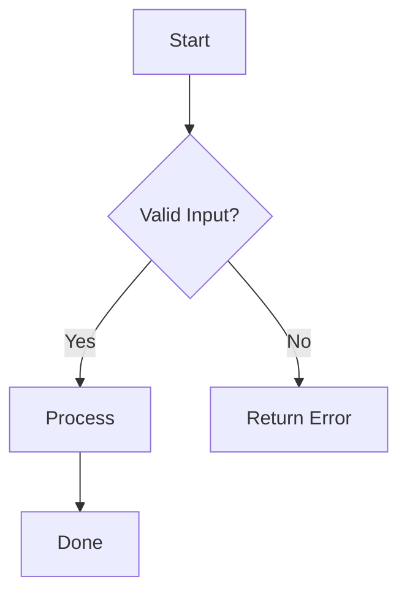
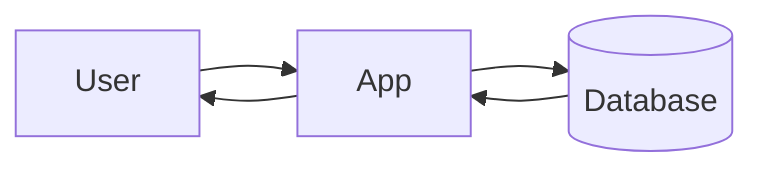
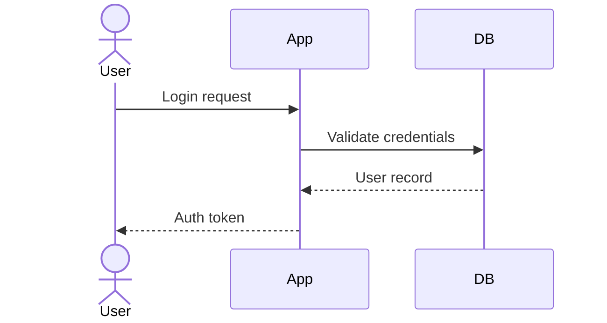
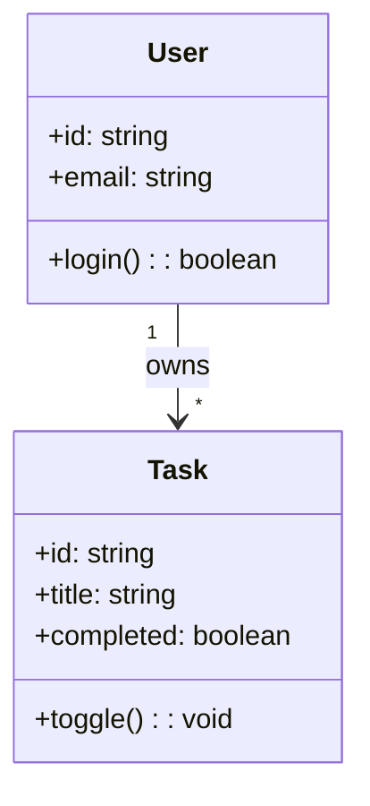
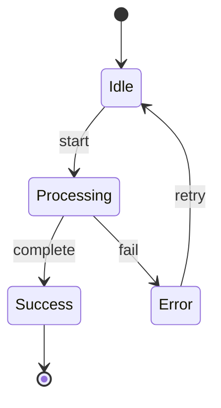
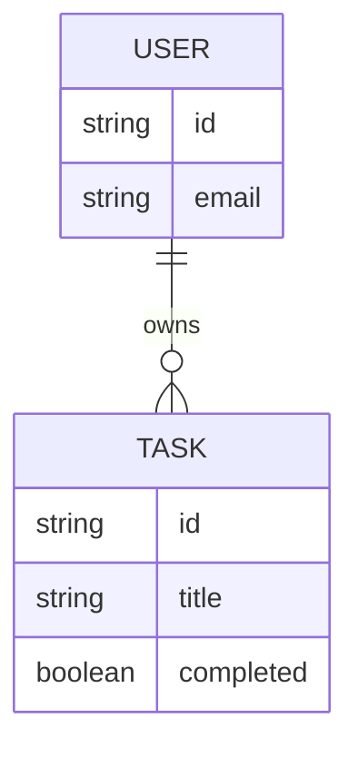
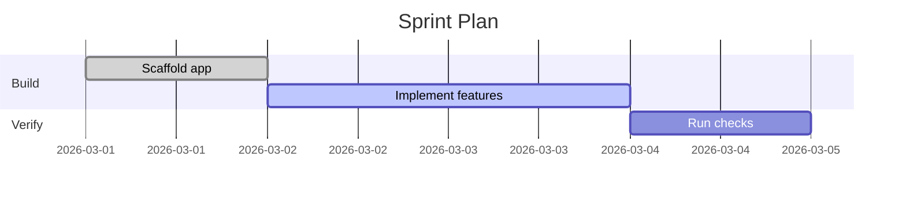
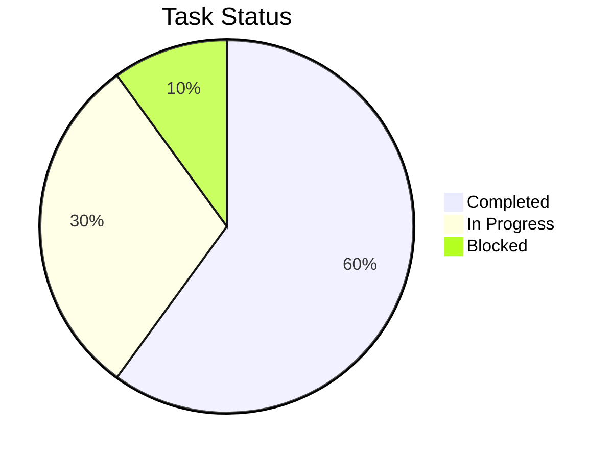

# Mermaid Diagram Generator

## Overview

Create Markdown-friendly diagrams using Mermaid syntax. This is ideal for README files, docs sites,
design notes, ADRs, and pull requests where diagram source should stay text-based and versioned.

## What is Mermaid?

Mermaid is a text-based diagram language that renders diagrams from plain text. It is widely supported
in Markdown tooling and documentation platforms.

Use Mermaid when you need:

- Diagram-as-code in repositories
- Fast iteration without drag-and-drop tools
- Easy review and diffs in pull requests
- Consistent architecture or process documentation

## Installation

```bash
# Requires Node.js

# Install Mermaid CLI globally
npm install -g @mermaid-js/mermaid-cli

# Or install locally in a project
npm install --save-dev @mermaid-js/mermaid-cli
```

## Output Formats

| Format | Extension | Notes |
| ------ | --------- | ----- |
| SVG    | `.svg`    | Best for docs and scaling |
| PNG    | `.png`    | Good for slides and static sharing |
| PDF    | `.pdf`    | Good for printable artifacts |

## Basic Workflow

### 1. Create Mermaid Source File



### 2. Save as `.mmd`

Example: `diagram.mmd`

### 3. Render with Mermaid CLI

```bash
# SVG output
mmdc -i diagram.mmd -o diagram.svg

# PNG output
mmdc -i diagram.mmd -o diagram.png

# PDF output
mmdc -i diagram.mmd -o diagram.pdf
```

## Diagram Types Supported

### Flowchart



### Sequence Diagram



### Class Diagram



### State Diagram



### ER Diagram



### Gantt Chart



### Pie Chart



## Command-Line Options

```bash
# Set custom background
mmdc -i diagram.mmd -o diagram.svg -b transparent

# Set width and height
mmdc -i diagram.mmd -o diagram.png -w 1600 -H 900

# Theme options: default, forest, dark, neutral, base
mmdc -i diagram.mmd -o diagram.svg -t dark

# Read from stdin and output file
cat diagram.mmd | mmdc -o diagram.svg
```

## Quarto and GitHub Markdown Integration


If your Markdown renderer supports Mermaid, diagrams render inline automatically.

## Tips for Better Mermaid Diagrams

1. **Prefer short node labels**: long labels reduce readability
2. **Use consistent direction**: `LR` for pipelines, `TD` for flows
3. **Group related nodes** with subgraphs in complex diagrams
4. **Keep concerns separate**: one diagram per concern
5. **Validate early** by rendering with `mmdc` before committing

## Quick Reference

```bash
# Create a sample file
cat > sequence.mmd << 'EOF'
sequenceDiagram
	Alice->>Bob: Request
	Bob-->>Alice: Response
EOF

# Render to SVG
mmdc -i sequence.mmd -o sequence.svg
```

## Troubleshooting

**Problem**: `mmdc: command not found`

- **Solution**: Install Mermaid CLI globally or run via local `npx mmdc`

**Problem**: Diagram fails to render with parse errors

- **Solution**: Validate syntax, indentation, and diagram type keywords

**Problem**: Fonts or layout look off in output

- **Solution**: Set explicit theme and dimensions (`-t`, `-w`, `-H`) and re-render

**Problem**: Mermaid block not rendering in Markdown viewer

- **Solution**: Ensure the target platform supports Mermaid fenced blocks
